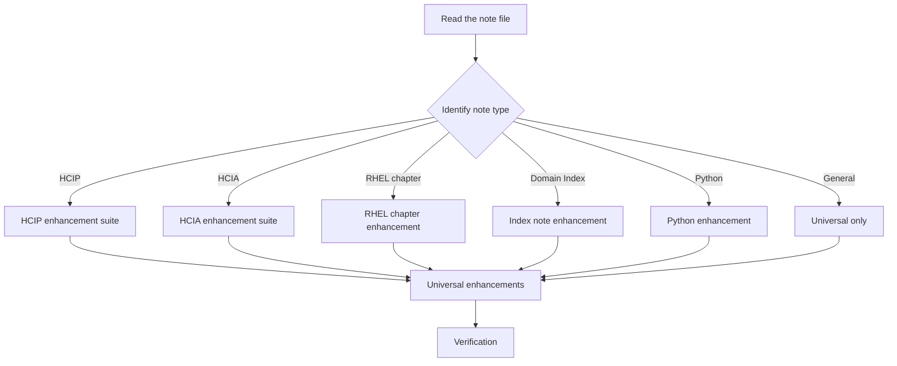
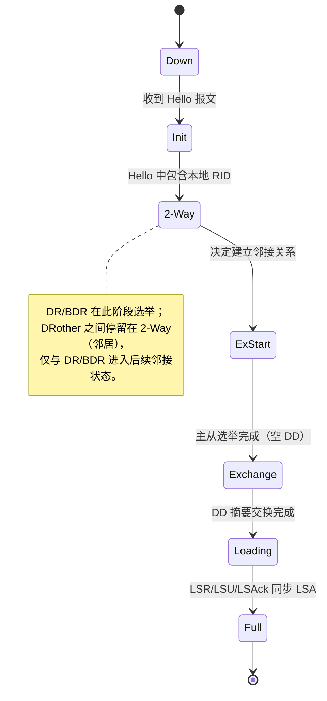
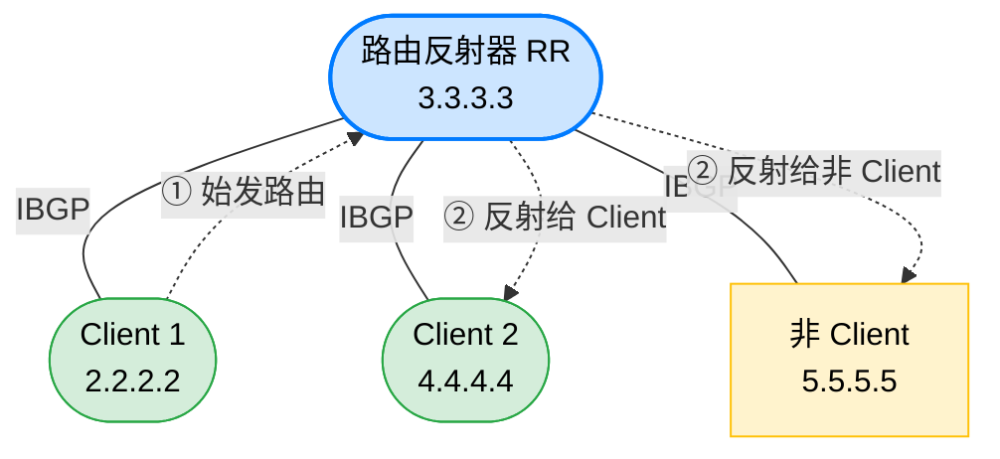
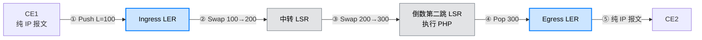
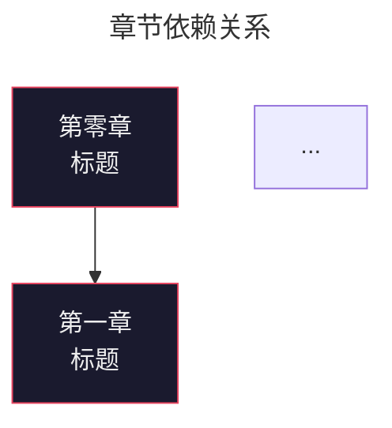

# Vault Advanced Features Enhancement Skill

## Workflow



### Phase 1: Identify Note Type

Read the note file. Determine type from its folder path and naming pattern:

| Folder contains | Naming prefix | Type |
|----------------|---------------|------|
| `23_Huawei/HCIP` | `HCIP_` | **HCIP** — heaviest enhancement |
| `23_Huawei/HCIA` | `HCIA_` | **HCIA** — medium enhancement |
| `21_RHEL/RHCSA` | `RHCSA_` | **RHCSA** — light enhancement |
| `21_RHEL` | `RHEL_00_Index` or `_Index` | **Domain Index** — index note |
| `24_Dev/Python` | `PY_` | **Python** — light enhancement |
| `91_System/Dashboard` | — | **Dashboard** — separate workflow |
| anything else | — | **General** — universal only |

### Phase 2: Read & Understand Note Content

Read the full note. Identify:
- What topic does it cover? (OSPF, BGP, LVM, etc.)
- Does it contain config examples? → may need `[!example]` callout
- Does it have exam-relevant content? → may need `[!faq]` callout
- Is there a process/flow/state-machine describable as a diagram? → may need Mermaid

> **Important**: Only add Mermaid diagrams when the note describes a **state machine**, **protocol flow**, **data flow**, **dependency graph**, or **architectural topology**. Do NOT force diagrams onto notes that don't need them.

### Phase 3: Apply Universal Enhancements

These apply to **every** note regardless of type.

#### 3a. Frontmatter Completion

Ensure frontmatter has these fields:

```yaml
---
tags:             # REQUIRED: domain tag + content type tag
  - <domain>      #   rhel | rhcsa | rhce | huawei | hcip | hcia | network | dev | python | ai
  - <type>        #   note | lab | cheatsheet | command | concept | troubleshooting | question | idea
aliases:          # RECOMMENDED: bilingual aliases for search
  - <English Name>
  - <中文名称>
created: 2026-07-07    # Date WITHOUT quotes
updated: 2026-07-07    # Date WITHOUT quotes
source: ""             # Source of knowledge (course name, URL, book)
status: draft | done | inbox
topic: ""              # Specific sub-topic
---
```

**Rules**:
- `created` / `updated` MUST be unquoted `YYYY-MM-DD` — never `"2026-07-07"`
- `aliases` should include both English and Chinese names (1–5 entries)
- `tags` list: first entry = domain tag, second = content type tag

#### 3b. Add Aliases

For technical notes (HCIP, HCIA, RHEL), add 3–5 aliases covering:
- English full name (e.g., `BGP`, `OSPF Advanced Packets and States`)
- Chinese name (e.g., `边界网关协议`, `OSPF 高级报文与状态`)
- Common abbreviations (e.g., `RR`, `LSA`)

Format:
```yaml
aliases:
  - BGP
  - 边界网关协议
  - Border Gateway Protocol
```

#### 3c. Verify fileClass Auto-Application

Metadata Menu fileClasses (`vault-note`, `hcip-note`) are pre-configured in `.obsidian/`. They auto-apply based on tags:
- `#rhel` / `#rhcsa` / `#rhce` / `#network` / `#dev` / `#python` / `#ai` / `#hcia` → **vault-note** (adds order/status/created/updated/topic/source fields)
- `#hcip` → **hcip-note** (extends vault-note, adds `section` field)

**No action needed** — just ensure the correct domain tag is in frontmatter.

---

### Phase 4: Type-Specific Enhancements

Apply the enhancement suite matching the note type identified in Phase 1.

---

#### 4a. HCIP Notes (heaviest)

Apply ALL of the following:

**① Add `section` field to frontmatter**

```yaml
section: "网络基础" | "广域网与 VPN" | "OSPF" | "路由控制与 BGP" | "补充内容"
```

Section mapping reference:
| Note range | Section |
|------------|---------|
| 01–04: Networking basics, VRRP, STP, VLAN | `网络基础` |
| 05–07: PPP, HDLC, FR, NAT, Tunnel, IPsec | `广域网与 VPN` |
| 08–10: OSPF advanced | `OSPF` |
| 11–13: Route redistribution, BGP, IS-IS | `路由控制与 BGP` |
| 14–15: MPLS, MPLS VPN | `补充内容` |

**② Add `[!abstract]` chapter summary at top of content**

Insert right after the `# Title` heading:

```markdown
> [!abstract] 章节摘要
> 一句话概括本章覆盖范围，列出核心知识点。
```

Example (from HCIP_12_BGP.md):
```markdown
> [!abstract] 章节摘要
> 覆盖 BGP 报文与状态机、对等体类型、路由发布（network / 重发布）、NextHop、路径属性与选路规则、路由反射器与联邦、路由聚合。HCIP 路由控制核心。
```

**③ Add `[!faq]` exam points at bottom of content**

Insert before the `## 相关笔记` section:

```markdown
> [!faq]- 考点速记
> 1. **问题 1？** → 答案。
> 2. **问题 2？** → 答案。
> 3. **问题 3？** → 答案。
```

Write 3–6 exam-relevant Q&A pairs. Use the foldable variant `[!faq]-` (collapsed by default).

**④ Add `[!example]` config example where applicable**

If the note contains configuration commands, wrap the most representative example:

```markdown
> [!example] 配置示例
> ```bash
> # commands here
> ```
```

Target placement: right before or after a command block.

**⑤ Add Mermaid topology diagram WHEN applicable**

Check if the note describes any of these diagrammable patterns:

| Pattern | Mermaid type | Example |
|---------|-------------|---------|
| State machine / lifecycle | `stateDiagram-v2` | OSPF neighbor states |
| Network topology (nodes + connections) | `graph` | BGP route-reflector |
| Data flow / packet flow | `graph LR` | MPLS label forwarding |
| Dependency / hierarchy | `graph TD` | Chapter dependency |

Use these exact style conventions:

````markdown

````

````markdown

````

````markdown

````

**Styling rules for all Mermaid graphs**:
- Use `NodeName["Label<br/>Subtext"]` for nodes with HTML line breaks
- Use `NodeName(["Label"])` for rounded rectangle nodes
- Use `NodeName["Label"]` for sharp rectangle nodes
- Always define `classDef` styles at the bottom
- Use CSS color names or hex: `#cce5ff` (blue), `#d4edda` (green), `#fff3cd` (yellow), `#e2e3e5` (gray)
- Add a prose explanation below the diagram (not inside it)

---

#### 4b. HCIA Notes (medium)

Apply: **① Frontmatter** + **② `[!abstract]`** + **③ `[!faq]`** from section 4a.

Skip: `section` (HCIA notes don't have it), `[!example]` (optional if has configs), Mermaid (optional if has state machine).

HCIA frontmatter example:
```yaml
---
tags:
  - huawei
  - hcia
  - note
aliases:
  - ACL
  - 访问控制列表
  - Access Control List
created: 2026-07-06
updated: 2026-07-06
source: "华为 HCIA 课程"
status: draft
topic: "ACL 访问控制列表"
order: 7
---
```

---

#### 4c. RHEL Chapter Notes (light)

Apply: **① Frontmatter** with RHEL-specific fields.

RHEL chapter frontmatter example:
```yaml
---
tags:
  - rhel
  - rhcsa
  - note
aliases:
  - Linux 磁盘管理
  - RHEL Disk Management
created: 2026-07-04
updated: 2026-07-04
source: "西安鸥鹏 RHCSA 培训文档 v2.0"
status: done
topic: "磁盘管理"
order: 12
chapter: "第十二章"
course_day: "Day 4"
---
```

Skip: `section`, semantic callouts (optional if index note), Mermaid (optional if has dependency graph).

---

#### 4d. Domain Index Notes (RHCSA_00_Index, etc.)

Apply: **ALL of**: Mermaid dependency graph + Dataview course table + Dataview stub table + Dataview tag index + semantic callouts.

**① Frontmatter** with aliases (6+ for bilingual search):
```yaml
---
tags:
  - rhel
  - rhcsa
  - course
  - index
aliases:
  - RHCSA 课程总览
  - RHEL 课程索引
  - RHEL 笔记索引
  - RHCSA Index
  - RHCSA 学习笔记
  - RHEL RHCSA Course Index
---
```

**② Mermaid chapter dependency graph**:

````markdown

````

**③ Dataview course schedule table**:

```markdown
```dataview
TABLE order AS "章", file.link AS "笔记", topic AS "内容概要"
FROM "<folder>"
WHERE order != null AND file.name != "<index-filename>"
SORT order ASC
```
```

**④ Dataview stub notes table (if applicable)**:

```markdown
```dataview
TABLE topic AS "主题", file.mtime AS "最后修改"
FROM "<folder>"
WHERE status = "inbox"
SORT file.name ASC
```
```

**⑤ Dataview tag index**:

```markdown
```dataview
TABLE rows.file.link AS "笔记"
FROM "<folder>"
WHERE file.name != "<index-filename>"
FLATTEN tags AS tag
GROUP BY tag
SORT tag ASC
```
```

**⑥ Semantic callouts** (placed at relevant locations):

```markdown
> [!abstract] 课程概览
> 课程描述、来源、覆盖范围。

> [!warning] Stub 笔记
> 以下为占位 stub，尚缺内容。

> [!faq]- 面试高频考点
> 1. **考点 1** → 答案
> 2. **考点 2** → 答案

> [!tip] 交互式浏览
> 另可打开 Canvas 白板...
```

---

#### 4e. Python Notes (light)

Apply: **① Frontmatter** with `order` field.

```yaml
---
tags:
  - dev
  - python
  - note
aliases:
  - Python Functions
  - Python 函数
created: 2026-07-04
updated: 2026-07-04
source: "Python 课程"
status: draft
topic: "函数"
order: 3
---
```

If the note is the course overview index (`PY_Course-Overview`), apply Index enhancements (section 4d) instead.

---

#### 4f. Dashboard (91_System/Dashboard.md)

Apply these Dataview queries (if not already present):

**① Area distribution**:
```markdown
## 按区域分布

```dataview
TABLE rows.file.link AS "笔记"
FROM -"91_System" AND -"90_Archive"
GROUP BY split(file.folder, "/")[0] AS "区域"
```
```

**② Status statistics**:
```markdown
## 按状态统计

```dataview
TABLE length(rows) AS "数量"
GROUP BY status AS "状态"
SORT status ASC
```
```

**③ Recent updates**:
```markdown
## 最近更新

```dataview
TABLE updated AS "最后更新", file.link AS "笔记"
FROM ""
SORT updated DESC
LIMIT 10
```
```

**④ Orphan notes** (notes with zero incoming links):
```markdown
## 🏝️ 孤立笔记（无反向链接）

```dataview
TABLE file.link AS "孤立笔记", file.mtime AS "最后修改"
FROM -"91_System" AND -"90_Archive" AND -"00_Inbox"
WHERE length(file.inlinks) = 0
SORT file.mtime DESC
```
```

---

### Phase 5: Verification

Run these checks after applying enhancements.

#### 5a. Frontmatter Integrity

```bash
# Check date quotes (should be 0)
grep -rn 'created: "' --include="*.md" <folder>/
grep -rn 'updated: "' --include="*.md" <folder>/

# Check required fields present
python3 -c "
import yaml, glob, sys
required = ['tags', 'created', 'updated', 'status']
for f in glob.glob('<folder>/**/*.md', recursive=True):
    if '91_System' in f or '.trash' in f: continue
    with open(f) as fh:
        try:
            data = next(yaml.safe_load_all(fh))
        except: continue
        missing = [k for k in required if k not in data]
        if missing: print(f'Missing {missing} in {f}')
"
```

#### 5b. Semantic Callout Verification

```bash
# Check abstract callout (should be 1)
grep -c '\[!abstract\]' <note-file>

# Check faq callout (should be 1)
grep -c '\[!faq\]' <note-file>

# Check example callout (should be 1 if note has configs)
grep -c '\[!example\]' <note-file>
```

#### 5c. Mermaid Diagram Verification

```bash
# Count mermaid blocks (expected: 1 if applicable)
grep -c '```mermaid' <note-file>

# Verify mermaid syntax (no obvious issues)
grep -A5 '```mermaid' <note-file>
```

#### 5d. Dataview Query Verification

```bash
# Count dataview blocks in index/dashboard notes
grep -c '```dataview' <note-file>

# Verify queries use valid FROM/WHERE
grep -E 'FROM|WHERE|SORT' <note-file>
```

#### 5e. Broken Link Check (smoke test)

```bash
# Quick check for [[wikilinks]] to non-existent notes
python3 -c "
import re, glob, os
notes = {os.path.splitext(os.path.basename(p))[0] for p in glob.glob('**/*.md', recursive=True) if not any(x in p for x in ['.obsidian','.git','.claude','.trash'])}
with open('<note-file>') as f:
    content = f.read()
links = re.findall(r'\[\[([^\]|]+)', content)
broken = [l for l in links if l not in notes and not l.startswith(('http','#','code/'))]
if broken: print(f'Broken links: {broken}')
"
```

#### 5f. Tags Verification

```bash
# Verify domain tag matches folder
# e.g., HCIP notes should have #hcip tag
grep 'tags:' -A3 <note-file>
```

---

## Edge Cases & Cautions

| Situation | Action |
|-----------|--------|
| Note already has `[!abstract]` | Skip — don't duplicate it |
| Note already has `[!faq]` | Skip — don't duplicate it |
| Note is a stub (`status: inbox`) | Only add frontmatter + `[!todo]` callout; skip Mermaid and full callouts |
| Note has no natural diagram topic | **Do not** force a Mermaid diagram — only add when the content has a flow/process/topology |
| `section` field already exists | Skip — don't overwrite |
| FileClass auto-applies via tag | Just ensure domain tag is correct — no manual fileClass config needed |
| User says "enhance all notes" | Apply universal enhancements to everything; type-specific only to matching folders |
| Templater template wasn't used | Still apply enhancements manually — the template is a starting point, not required |

---

## Examples

### Complete HCIP Note Enhancement (HCIP_12_BGP.md)

Before: plain frontmatter + raw content.
After: frontmatter with `section` + `[!abstract]` + Mermaid RR topology + `[!faq]` + aliases.

See the actual file at `20_Areas/23_Huawei/HCIP/HCIP_12_BGP.md for the complete reference.

### Complete Domain Index Enhancement (RHCSA_00_Index.md)

Before: manual chapter list.
After: Mermaid dependency graph + Dataview course table + Dataview stub table + Dataview tag index + `[!abstract]` + `[!warning]` + `[!faq]` + `[!tip]` + 6 aliases.

See `20_Areas/21_RHEL/RHCSA/RHCSA_00_Index.md` for the complete reference.

---

## References

- Obsidian Markdown Skill _(not yet curated in this repo; syntax references below are pending)_: wikilinks, embeds, callouts syntax
- [Mermaid Templates](./references/mermaid-templates.md) — diagram syntax reference
- [Dataview Queries](./references/dataview-queries.md) — query reference
- [Mermaid Documentation](https://mermaid.js.org/syntax/)
- [Dataview Documentation](https://blacksmithgu.github.io/obsidian-dataview/)
- [Metadata Menu Documentation](https://mdelobelle.github.io/metadatamenu/)

---

## 已知不足（v0）

> 2026-07-10 用户反馈：已实际跑过多个笔记类型（HCIP / HCIA / RHEL / Index 等），主流场景顺滑，无重大问题。Python / Dashboard 类型暂未跑过。

诚实记录方法论 §4 / §6 要求的潜在风险与未覆盖边界：

- 依赖外部 `obsidian-markdown` skill（callouts / wikilinks 语法参考），本仓库尚未收录
- SKILL.md 体量较大（600+ 行），按需读取体验待优化
- 6 种笔记类型未全部跑过：Python / Dashboard 暂未实战验证
- Mermaid 风格硬编码配色（蓝/绿/黄/灰），跨主题时可能有违和
- Dataview 查询的 `FROM "20_Areas/21_RHEL/RHCSA"` 路径硬编码，迁库时需手工改
- 笔记类型识别仅依赖 folder + 文件名前缀，跨 vault 结构（如不按 21/22/23 分区）时可能误判

---

## 历史

- 2026-07-10: v0 沉淀，从用户原 `vault-enhance` 迁移到 `obsidian-vault-enhance`，落位 `grown-workflow/.claude/skills/obsidian-vault-enhance/`。来源：用户描述「笔记大体都完善后，利用这个 skills 来补充 Obsidian 的高级功能」（重复 ≥10 次，资料收集型，A 边界）。