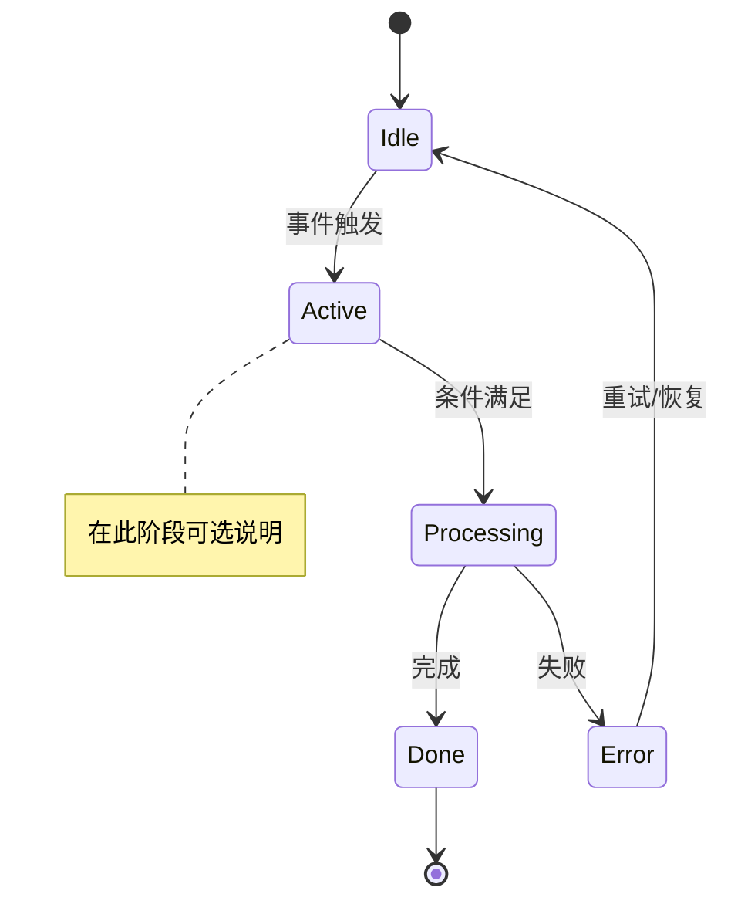
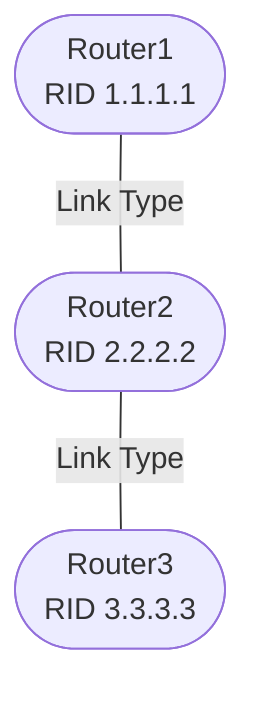
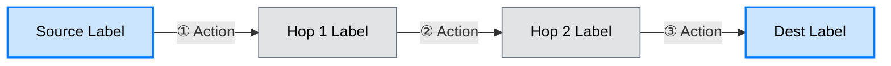
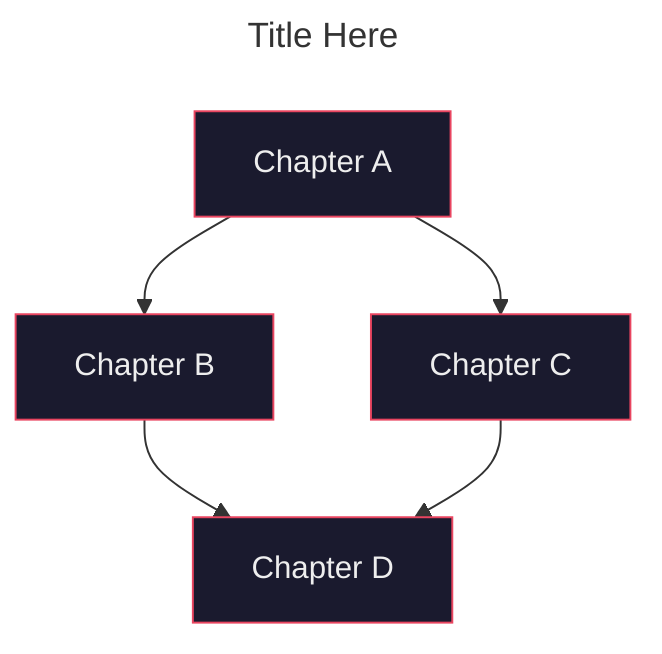

# Mermaid Diagram Templates for Vault Notes

Reusable Mermaid diagram templates. Match the type to the content and adapt node labels.

## State Machine (stateDiagram-v2)

**Use for**: Protocol state machines, lifecycle flows, process states.



**OCF 模式模板**:
```text
[*] --> Initial
Initial --> Ready: condition1
Ready --> Running: condition2
Running --> Completed: success
Running --> Failed: error
Failed --> Ready: retry
Completed --> [*]
```

## Network Topology (graph TD)

**Use for**: Network diagrams, component architecture, node relationships.



## Data Flow (graph LR)

**Use for**: Packet flow, forwarding process, data pipeline.



## Dependency Graph (graph TD with title)

**Use for**: Course chapter dependencies, concept prerequisites.



## Styling Quick Reference

| Style | Fill | Stroke | Use for |
|-------|------|--------|---------|
| `fill:#cce5ff,stroke:#007bff` | Light blue | Blue | Primary nodes, routers, LER |
| `fill:#d4edda,stroke:#28a745` | Light green | Green | Client nodes, secondary |
| `fill:#fff3cd,stroke:#ffc107` | Light yellow | Yellow | Non-client, DR/BDR |
| `fill:#e2e3e5,stroke:#6c757d` | Light gray | Gray | Intermediate, LSR |
| `fill:#1a1a2e,stroke:#e94560,color:#eee` | Dark navy | Red | Chapter nodes (dark bg) |

## Shape Quick Reference

| Syntax | Shape | Example |
|--------|-------|---------|
| `A["text"]` | Rectangle | `NC["非 Client"]` |
| `A(["text"])` | Rounded rectangle | `RR(["路由反射器"])` |
| `A{"text"}` | Diamond (decision) | `Cond{"条件判断"}` |
| `A[["text"]]` | Stadium (pill) | `Db[["Database"]]` |

## References

- [Mermaid Official Docs](https://mermaid.js.org/syntax/)
- [Mermaid Live Editor](https://mermaid.live/)